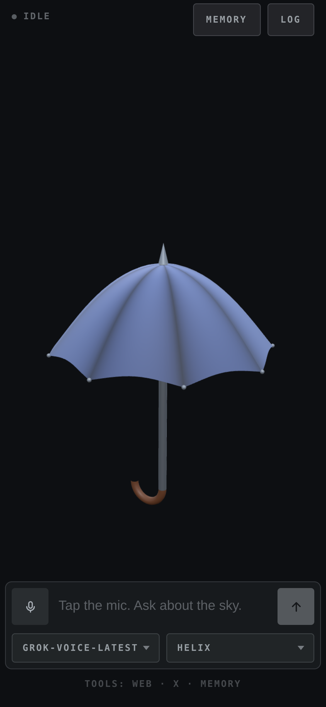

# Stormy

A weather voice agent rendered as an umbrella — dry, ominous, quietly delighted
by a front coming through, and useless at small talk about nice days. It runs on
an xAI Grok speech-to-speech session, and the canopy's flutter, sway and squash
are driven by the live audio, so it moves with whichever of you is talking.

It searches the web for every forecast it gives — weather from a model's memory
is a guess — and can call remote MCP servers. It also remembers what you tell it
to, between calls.


<p align="center">
  
</p>

## Run

```sh
npm install
cp .env.example .env      # add your XAI_API_KEY
npm run dev               # → http://localhost:5173
```

Click the mic, allow the browser's microphone prompt, and ask about the sky.
Talk over him and he stops — and blows inside out.

Tapping the mic is the microphone switch: turning it off stops what you send and
leaves the answer playing, and the conversation is still there when you turn it
back on. It also switches itself off after a minute of silence, and the call
survives that too. Holding the mic down is the hang-up — a ring closes around it
while you hold, and the call ends when it lands.

`tools` has a switch for each tool it can reach for — web search, X search, and
any MCP server the environment gave it. Switching one off takes it out of the
call already in progress, and it stays off in that browser until you switch it
back on. Nothing there can add a tool the server was not started with.

The log keeps every conversation. `continue` on one picks it back up: the call is
dialled again with those turns handed over as context, and what you say from
there lands in the same entry rather than a new one.

| Script | |
|---|---|
| `npm run dev` | Vite, with the proxy mounted as middleware — one process |
| `npm run dev:lan` | The same, over HTTPS on the network — for a phone |
| `npm run build` | Bundles the client to `dist/` |
| `npm start` | Serves `dist/` with the same proxy in front |
| `npm run preview` | `build` then `start` |
| `npm run preview:lan` | `build` then `start`, over HTTPS on the network |
| `npm test` | `node:test`, against a stub xAI socket |
| `npm run lint` | ESLint |

CI runs the lint, the tests on Node 22.12 and 24, and a build that then has to
boot and serve itself over both HTTP and HTTPS.

To run it on a phone, or in Docker, see
[configuration](docs/configuration.md#on-a-phone).

## Docs

- [**Configuration**](docs/configuration.md) — every environment variable, the
  HTTPS setup a phone needs for microphone access, Docker, and the tools.
- [**Design notes**](docs/design.md) — how the call is wired, the audio path,
  what's in `localStorage`, the moods, the source layout, and the seam another
  provider would have to implement.
- [**AI Output Disclaimer**](docs/ai-output-disclaimer.md) — what the model says
  is the model's, not the author's, plus the risks that are specific to a live
  microphone and speech you hear before anyone can check it.
- [**Not a Companion**](docs/not-a-companion.md) — Stormy is a toy and a demo.
  It is not a friend, a therapist, or a partner, and the project will not grow in
  that direction.
